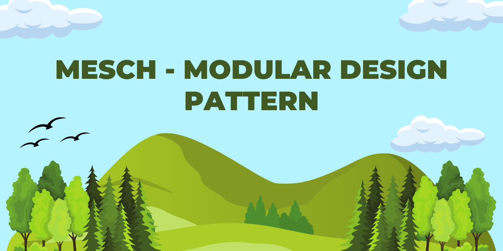

# MESCH



Welcome to MESCH, an architecture designed to provide a robust and scalable framework for developing software applications. MESCH stands for Models, Enums, Services, Contracts & Helpers, each play a crucial role in building efficient and maintainable systems.

## What is MESCH?

MESCH is a design pattern for software development that emphasizes modularity and clear organization. It provides a robust and scalable framework for building efficient and maintainable systems. This architecture is particularly beneficial for its clarity, maintainability, flexibility, scalability, reusability, and efficiency.

## Advantages of MESCH

- **Clarity and Maintainability:** MESCH promotes clear and concise code organization, making it easier to understand and maintain the software over time.
- **Flexibility and Scalability:** The modular structure of MESCH allows for easy integration of new features and enhancements, making the architecture highly adaptable to evolving requirements.
- **Reusability and Efficiency:** By leveraging enums, contracts, and helpers, MESCH facilitates code reuse and promotes efficient development practices, resulting in faster time-to-market and reduced development effort.

## How does MESCH work?

To grasp the concept of MESCH, it's necessary to delve into its fundamental principles.

### Models

Models represent the data structures and entities within the application. They define the properties and behaviors of these entities, often related to tables and external data sources.

```cs
public class Product
{
    public int Id { get; set; }
    public string Name { get; set; }
    public decimal Price { get; set; }
}
```

### Enums

Enums represent a set of named constants with a finite range of values. They provide a way to define and use symbolic names for these values, making the code readable and maintainable.

```csharp
public enum ProductCategory
{
    Electronics,
    Clothing,
    Books
}
```

### Services

Services contain the business logic and perform a ton of different operations within the application. They typically interact with data through models, which enforces the business rules, and coordinate activities between different components.

```csharp
public interface IProductService
{
    Product GetProductById(int id);
    void AddProduct(Product product);
}

public class ProductService : IProductService
{
    public Product GetProductById(int id)
    {
        // Code to fetch product from database
    }

    public void AddProduct(Product product)
    {
        // Code to add product to database
    }
}
```

### Contracts

Contracts define the interfaces and agreements between different components in a system. They specify what each component can do, without implementing the actual functionality. Contracts act as blueprints for how components should interact with each other.

```csharp
public interface IProductService
{
    Product GetProductById(int id);
    void AddProduct(Product product);
}
```

### Helpers

Helpers contain utility functions or methods that provide commonly used functionality across the application. They encapsulate reusable logic and help to keep the codebase clean and DRY (Don't Repeat Yourself).

```csharp
public static class Logger
{
    public static void Log(string message)
    {
        // Logging functionality...
    }
}
```

In the MESCH architecture, these components work together seamlessly, with contracts defining the interfaces between them. Enums provide clear and meaningful constants used throughout the system. Models encapsulate data structures, while services orchestrate the overall application logic, leveraging helpers for reusable functionalities.

## Real-World Software Projects Utilizing MESCH

The following projects are currently employing the MESCH design pattern:

- [Astra](https://github.com/luke-beep/Astra)
- [ssharp](https://github.com/luke-beep/ssharp)
